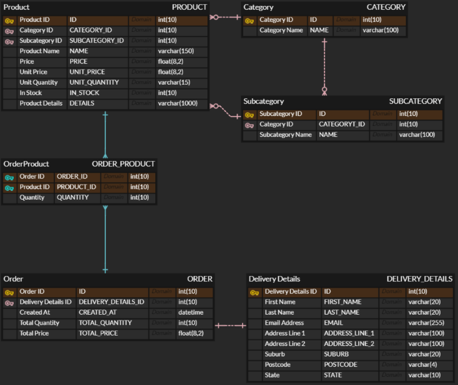

# Moolmorths, Simple Online Grocery Store

This is an individual assignment submitted for 31748 Programming on the Internet from University of Technology, Sydney (UTS).

## Website Screenshots

  
  
  
  
  
  

## Tech Stack

**1. Frontend**

- React [SPA]
- TypeScript
- Vite [Bundler]
- Zustand [Local State Management]
- React Query [Server State Management]
- Tailwind CSS [CSS Utilities]

**2. Backend**

- NestJS [API Server]
- TypeScript
- MySQL [Database]
- TypeORM [Database Connection]
- AWS Elastic Beanstalk [Deployment]

## ERD

